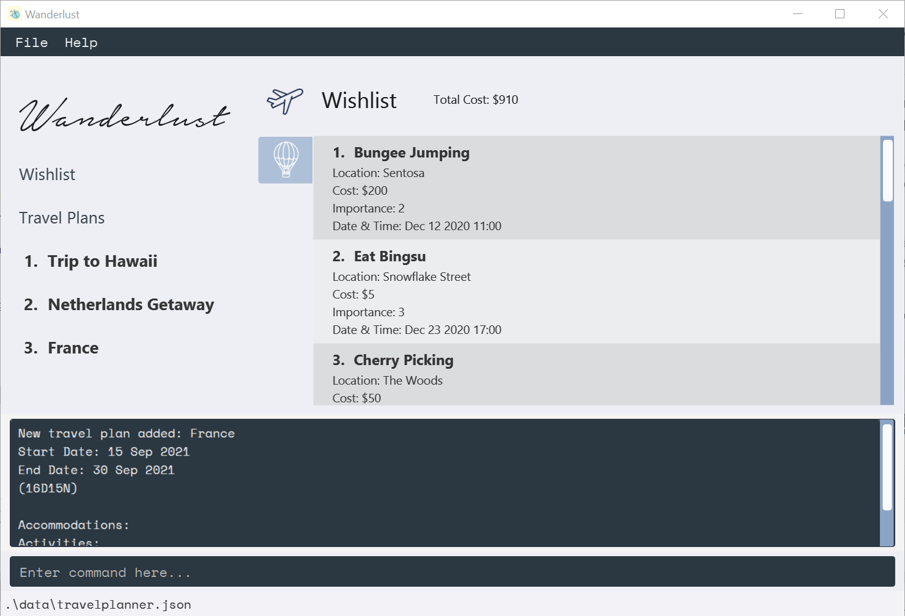
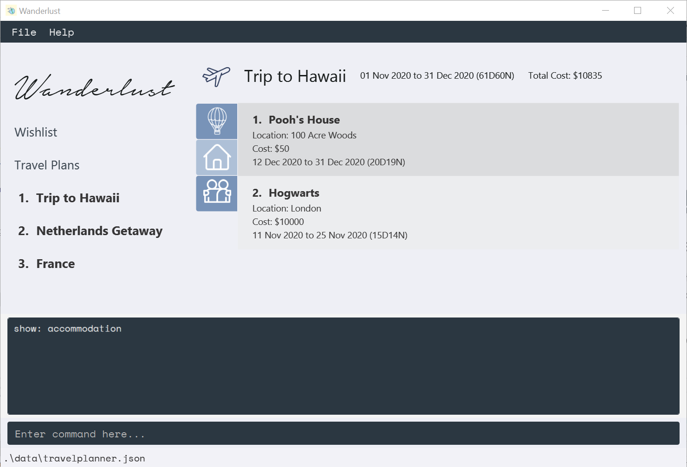
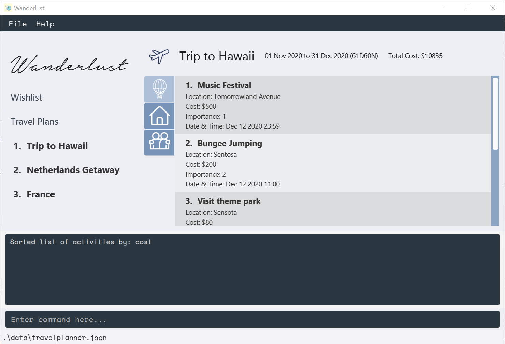

# Wanderlust v1.3 User Guide

## Introduction

WanderLust helps tech-savvy travellers to plan their trips in a structured and efficient manner by providing them with a holistic travel planner.
It is optimized for CLI users so that destinations and details can be added faster by typing in commands.

--------------------------------------------------------------------------------------------------------------------

## Table of Contents
* [Introduction](#introduction)
* [Quick Start](#quick-start)
* [Tutorial Guide](#tutorial-guide)
* [Command Summary](#command-summary)
* [Directories](#directories)
* [Parameters](#parameters)
    * [Activity Parameters](#activity-parameters)
    * [Accommodation Parameters](#accommodation-parameters)
    * [Friend Parameters](#friend-parameters)
    * [Travel Plan Parameters](#travel-plan-parameters)
* [Features](#features)
    * [Goto](#goto)
        1. [Goto a Travel Plan (G)](#1-goto-a-travel-plan-g)
        2. [Goto Wishlist (G)](#2-goto-wishlist-g)
    * [Add](#add)
        1. [Adding a Travel Plan (G)](#1-adding-a-travel-plan-g)
        2. [Adding an Activity (L)](#2-adding-an-activity-l)
        3. [Adding an Accommodation (L)](#3-adding-an-accommodation-l)
        4. [Adding a Friend (L)](#4-adding-a-friend-l)
    * [Delete](#delete)
        1. [Deleting a Travel Plan (G)](#1-deleting-a-travel-plan-g)
        2. [Deleting an Activity (L)](#2-deleting-an-activity-l)
        3. [Deleting an Accommodation (L)](#3-deleting-an-accommodation-l)
        4. [Deleting a Friend (L)](#4-deleting-a-friend-l)
    * [Edit](#edit)
        1. [Editing a Travel Plan (G)](#1-editing-a-travel-plan-g)
        2. [Editing an Activity (L)](#2-editing-an-activity-l)
        3. [Editing an Accommodation (L)](#3-editing-an-accommodation-l)
        4. [Editing a Friend (L)](#4-editing-a-friend-l)
    * [Find](#find)
        1. [How it works](#how-it-works)
        2. [Finding activities (L)](#1-finding-activities-l)
        3. [Finding accommodations (L)](#2-finding-accommodations-l)
        4. [Finding friends (L)](#3-finding-friends-l)
    * [Show](#show)
        1. [Showing activity tab (L)](#1-showing-activity-tab-l)
        2. [Showing accommodation tab (L)](#2-showing-accommodation-tab-l)
        3. [Showing friend tab (L)](#3-showing-friend-tab-l)
    * [Sort](#sort)
        1. [Sorting by cost (L)](#1-sorting-by-cost-l)
        2. [Sorting by date (L)](#2-sorting-by-date-l)
        3. [Sorting by datetime (L)](#3-sorting-by-datetime-l)
        4. [Sorting by importance (L)](#4-sorting-by-importance-l)
        5. [Sorting by name (L)](#5-sorting-by-name-l)
        6. [Sorting by passport (L)](#6-sorting-by-passport-l)
        7. [Sorting by mobile (L)](#7-sorting-by-mobile-l)
    * [Copy](#copy)
        1. [Copying an activity (L)](#1-copying-an-activity-l)
    * [Move](#move)
        1. [Moving an activity (L)](#1-moving-an-activity-l)
    * [Clear](#clear)
        1. [Clearing the data (G)](#1-clearing-the-data-g)
    * [Help](#help)
        1. [Refer to UserGuide (G)](#1-refer-to-userguide-g)
    * [Exit](#exit)
        1. [Exiting the application (G)](#1-exiting-the-application-g)
* [FAQ](#faq)

--------------------------------------------------------------------------------------------------------------------

## Quick Start 

1. Ensure you have Java `11` or above installed in your computer.
2. Download the latest `Wanderlust.jar` [here](https://github.com/AY2021S1-CS2103-T14-3/tp/releases/tag/v1.3)
3. Copy the file to the folder you want to use as the _home folder_ for Wanderlust
4. Run java -jar Wanderlust.jar in the command prompt to start the application
5. Type the command in the command box and press Enter to execute. You can find the list of commands available in the [Command Summary](#command-summary)

--------------------------------------------------------------------------------------------------------------------

## Tutorial Guide

Here are the steps you can follow to get familiar with _Wanderlust_

Command | Description
------------ | -------------
`clear` | Remove all preset data from Wanderlust
`add -travelplan n/Singapore sd/2021-05-05 ed/2021-06-06` | Adds a Singapore travelPlan to the travelPlan list 
`goto -travelplan 1` | Go to the Singapore travelplan
`add -friend n/Tom p/S1234567K m/84329182` | Add a friend name `Tom` with passport number `S1234567K` and mobile number `84329182`
`add -friend n/Jerry p/S4538201A m/89201987` | Add a friend name `Jerry` with passport number `S4538201A` and mobile number `89201987`
`find -friend tom` | Finds all friend with name tom
`delete -friend 1` | Removes friend at index 1 in the friendlist shown
`show -Activity` | Switch to the activity tab
 

--------------------------------------------------------------------------------------------------------------------
## Command Summary

There are a total of 12 general commands.
The table briefly describes the commands and its usage. Full details will be given under [Features](#features).

Command | Parameters | Description
------------ | ------------- | -------------
`add -OBJECT` | `OBJECT` activity/ accommodation/ friend/ travelPlan | Creates the given object type
`delete -OBJECT INDEX` | `OBJECT` activity/ accommodation/ friend/ travelPlan   `INDEX` Specific number of the indexed list object | Deletes the given object type
`edit -OBJECT INDEX` | `OBJECT` activity/ accommodation/ friend/ travelPlan   `INDEX` Specific number of the indexed list object| Edits the details of the given object type
`goto -DIRECTORY` | `DIRECTORY` wishlist/ travelPlan with specified index | Navigate to the specific travel plan/ wishlist
`find -OBJECT KEYWORD` | `OBJECT` activity/ accommodation/ friend  `KEYWORD` keywords to search for  | Finds the given object type whose names contain any of the given keywords
`show -OBJECT` | `OBJECT` activity/ accommodation/ friend | Navigate to the specific travel plan object tab
`sort -OBJECT KEYWORD` |`OBJECT` activity/ accommodation/ friend  `KEYWORD` cost/ name/ importance/ date | Sorts the specific travel plan object based on the keyword
`copy ACTIVITY_INDEX TRAVELPLAN_INDEX` | `ACTIVITY_INDEX`/ specific number of target activity `TRAVELPLAN_INDEX`/ specific number of target TravelPlan | Copy over the specified activity from wishlist to the travelPlan
`move ACTIVITY_INDEX TRAVELPLAN_INDEX` | `ACTIVITY_INDEX`/ specific number of target activity `TRAVELPLAN_INDEX`/ specific number of target TravelPlan  | Move over the specified activity from wishlist to the travelPlan
`clear` | not applicable | Clear all preexisting data
`exit` | not applicable | Exit the application
`help`| not applicable | Provide a link to access Wanderlust UserGuide for help

## Directories

There are two directories within Wanderlust. They are WishList and TravelPlan
The table describes the list of commands available at each directory.

Wishlist | TravelPlan
-------------  | -------------
`goto -DIRECTORY`|`goto -DIRECTORY`
`show -activity`| `show -OBJECT`
`sort -activity` | `sort -OBJECT`
`find -activity`| `find -OBJECT`
`add -activity` |  `add -OBJECT`
`delete -activity`| `delete -OBJECT`
`edit -activity` | `edit -OBJECT`
`move ACTIVITY_INDEX TRAVELPLAN INDEX`  |
`copy ACTIVITY_INDEX TRAVELPLAN INDEX` |

--------------------------------------------------------------------------------------------------------------------
## Parameters

The table below shows the type of parameters each different object requires.
Do note that all parameters stated are compulsory when creating the object.

#### Activity Parameters

Name of Parameter | Description | Requirement
------------ | ------------- | -------------
`n/NAME` | Name of the activity. | Names should only contain alphanumeric characters, punctuations and spaces, and it should not be blank.
`l/LOCATION` | Location/ Address of the activity | Location can take any values, and it should not be blank.
`i/LEVEL_OF_IMPORTANCE` | The priority assigned to the activity | Importance Level should only contain numbers, and it should range from 1 - 5, with 5 being the most important while 1 being the least important.
`c/COST` | Cost of the activity | Cost should only contain numbers, and it should be a positive integer.
`d/DATE_AND_TIME` | Date and Time intended to do the activity | Format of date is in YYYY-MM-DD and format of time is HH:MM (24h clock). 

**Notes about Activity:** 

* Different Activity can have the same datetime within _Wanderlust_ travelPlan and wishlist.

#### Accommodation Parameters

Name of Parameter | Description | Requirement
------------ | ----------- | -------------
`n/NAME` | Name of the accommodation | Name should only contain alphanumeric characters, punctuations and spaces, and it should not be blank.
`l/LOCATION` | Location/ Address of the accommodation | Location can take any values, and it should not be blank.
`c/COST` | Cost of the accommodation | Cost should only contain numbers, and it should be a positive integer.
`sd/START_DATE` | Start date of accommodation | Must be in the format of YYYY-MM-DD.
`ed/END_DATE` | End date of accommodation | Must be in the format of YYYY-MM-DD.

**Notes about Accommodation:** 

* Different Accommodation can have start date and end date overlap within _Wanderlust_ travelPlan.

#### Friend Parameters

Name of Parameter | Description | Requirement
------------ | ------------- | -------------
`n/NAME` | Name of the friend. | Name should only contain alphanumeric characters, punctuations and spaces, and it should not be blank.
`m/MOBILE_NUMBER` | Mobile number of the friend cell mobile | Must be valid Singapore mobile number that follows the format 1 specific digit from [89] and 7 more digits.
`p/PASSPORT_NUMBER` | Passport number of the friend passport | Passport numbers should follow the format: 1 specific character from [STFG] + 7 digits + 1 ending specific character from [A-Z].

**Notes about Friend:** 

* Passport is case-sensitive

#### Travel Plan Parameters

Name of Parameters | Description | Requirement
------------ | ------------- | -------------
`n/NAME` | Name of the travel plan. | Name should only contain alphanumeric characters, punctuations and spaces, and it should not be blank.
`sd/START_DATE` | Start date of travel plan| Must be in the format of YYYY-MM-DD.
`ed/END_DATE` | End date of travel plan | Must be in the format of YYYY-MM-DD.

**Notes about Travel Plan:** 

* Start date of Travel Plan must be either current date or any date after current date

--------------------------------------------------------------------------------------------------------------------

## Features

**Notes about the command format:** 

* Words in `UPPER_CASE` are the parameters to be supplied by the user. 
  e.g. in `edit -activity INDEX n/NAME`, `NAME` and `INDEX` are parameters which can be used as `edit -activity 1  n/Cultural Visit`.

**Notes about the feature section:** 

* Commands that can be used globally and locally are tagged `(G)` for global and `(L)` for local respectively in the **features section** of this user guide. 
  e.g `Adding a Travel Plan (G)`  
* Global commands can be used anywhere within Wanderlust.
* Local commands can only be used within the wishlist or specified travelplan.
 

## Goto

The goto command is used to navigate to various directories within the travel planner. The GUI display depends on the
state of the current directory, which is changed using the goto command. On start, the default directory of the program
is `wishlist`. 
 

>Directories in Wanderlust include:
>1. `wishlist`
>2. `travelplan INDEX` 

#### Wishlist

#### TravelPlan 1

This allows users to easily add, delete, view and edit information within the wishlist or a specific travel plan without
having to type their directory names in each command. This also means that **some commands can only be used locally within a
certain directory, and responses to these commands will depend on the current directory.** They will be marked with (G) for global
commands and (L) for local commands.

### 1. Goto a Travel Plan (G)
Navigates the UI to a specific travel plan.

Format: `goto -travelplan INDEX`

Example: `goto -travelplan 2`

### 2. Goto Wishlist (G)
Navigates the UI to the wishlist.

Format: `goto -wishlist`

Example: `goto -wishlist`

## Add
Refer to valid tags for each object [here](#parameters)

### 1. Adding a Travel Plan (G)
Creates a new travel plan and adds it to Wanderlust’s travel planner.
Format of date is in YYYY-MM-DD.

Format: `add -travelplan n/NAME sd/START_DATE ed/END_DATE`

Example: `add -travelplan n/France sd/2020-09-15 ed/2020-09-30`

### 2. Adding an Activity (L)
Creates a new activity and adds it to the travel plan/wishlist in the current directory.
Format of date is in YYYY-MM-DD and format of time is HH:MM (24h clock). 
Activities can have the same datetime within the travelPlan or wishlist in _Wanderlust_.

Format: `add -activity n/NAME i/LEVEL_OF_IMPORTANCE l/LOCATION c/COST d/YYYY-MM-DD HH:mm`

Example: `add -activity n/Universal Studios Singapore i/5 l/Sentosa c/88 d/2020-06-09 10:10`

### 3. Adding an Accommodation (L)
Creates an accommodation that contains information about the place of stay and adds it to the travel plan in the current directory.
This command can only be used within a travel plan. Use goto NAME_OF_TRAVEL_PLAN before adding accommodations.

Format: `add -accommodation n/NAME l/LOCATION c/COST sd/YYYY-MM-DD ed/YYYY-MM-DD`

Example: `add -accommodation n/St Regis Hotel l/Orchard Road c/250 sd/2020-10-11 ed/2020-10-15`

### 4. Adding a Friend (L)
Creates a friend object that contains basic information about the user and
other travellers and adds it to the travel plan in the current directory.

Format: `add -friend n/NAME m/MOBILE_NUMBER p/PASSPORT_NUMBER`

Example: `add -friend n/John m/81234567 p/S1234567K`

## Delete

### 1. Deleting a Travel Plan (G)

Deletes a travel plan at the given index from the travel planner.

Format: `delete -travelplan INDEX`

Example: `delete -travelplan 3`

### 2. Deleting an Activity (L)

Deletes an activity at the given index from the travel plan/wishlist in the current directory.

Format: `delete -activity INDEX`

Example: `delete -activity 3`

### 3. Deleting an Accommodation (L)

Deletes the accommodation at the given index from the travel plan in the current directory.
This command can only be used within a travel plan. Use `goto NAME_OF_TRAVEL_PLAN` before deleting accommodations.

Format: `delete -accommodation INDEX`

Example: `delete -accommodation 2`

### 4. Deleting a Friend (L)

Deletes the friend at a given index from the travel plan in the current directory.
This command can only be used within a travel plan. Use `goto NAME_OF_TRAVEL_PLAN` before deleting a friend.

Format: `delete -friend INDEX`

Example: `delete -friend 1`

## Edit
Refer to valid tags for each object [here](#parameters)

### 1. Editing a Travel Plan (G)

Edits an existing travel plan in the travel planner by its index.

Format: `edit -travelplan INDEX n/NAME sd/YYYY-MM-DD ed/YYYY-MM-DD​`

Example: `edit -travelplan 1 n/Paris sd/2020-10-11 ed/2020-10-15`

### 2. Editing an Activity (L)

Edits an existing activity in the travel plan/wishlist in the current directory.

Format: `edit -activity INDEX n/NAME i/LEVEL_OF_IMPORTANCE l/LOCATION c/COST d/YYYY-MM-DD HH:mm`

Example: `edit -activity 3 n/Visit theme park i/5 l/Sensota c/80 d/2020-10-11 15:00`

### 3. Editing an Accommodation (L)

Edits an existing accommodation in the travel plan in the current directory.
This command can only be used within a travel plan. Use `goto NAME_OF_TRAVEL_PLAN` before editing an accommodation.

Format: `edit -accommodation INDEX n/NAME l/LOCATION c/COST sd/YYYY-MM-DD ed/YYYY-MM-DD​`

Example: `edit -accommodation 3 n/The Hotel l/Bukit Timah c/60 sd/2020-10-11 ed/2020-10-15`

### 4. Editing a Friend (L)

Edits an existing friend in the travel plan in the current directory.
This command can only be used within a travel plan. Use `goto NAME_OF_TRAVEL_PLAN` before editing a friend.

Format: `edit -friend INDEX n/NAME m/MOBILE_NUMBER p/PASSPORT_NUMBER​`

Example: `edit -friend 3 n/John m/81234567 p/S7654321K`

## Find

### How it works

* The search is case-insensitive. e.g `hans` will match `Hans`
* The order of the keywords does not matter. e.g. `Hans Bo` will match `Bo Hans`
* Only the name is searched.
* Only full words will be matched e.g. `Han` will not match `Hans`
* Travel Plan Object matching at least one keyword will be returned (i.e. `OR` search). e.g. `Hans Bo` will return `Hans Gruber`, `Bo Yang`

### 1. Finding activities (L)

Finds activities in the travel plan/wishlist in the current directory whose names contain any of the given keywords.

Format: `find -activity KEYWORD [MORE_KEYWORDS]`

Example: `find -activity ice`

### 2. Finding accommodations (L)

Finds accommodations in the travel plan in the current directory whose names contain any of the given keywords.
This command can only be used within a travel plan. Use `goto NAME_OF_TRAVEL_PLAN` before finding accommodations.

Format: `find -accommodation KEYWORD [MORE_KEYWORDS]`

Example: `find -accommodation hotel`

### 3. Finding friends (L)

Finds friends in the travel plan in the current directory whose names contain any of the given keywords.
This command can only be used within a travel plan. Use `goto NAME_OF_TRAVEL_PLAN` before finding friends.

Format: `find -friend KEYWORD [MORE_KEYWORDS]`

Example: `find -friend John`

## Show

### 1. Showing Activity Tab (L)

Switches the current Ui view to show Activity tab under the travel plan object panel.
This command has no effect in a wishlist as a wishlist only contains activities.

Format/ Example: `show -activity`

### 2. Showing Accommodation Tab (L)

Switches the current Ui view to show Accommodation tab under the travel plan object panel.
This command has no effect in a wishlist as a wishlist does not contain Accommodation.

Format/ Example: `show -accommodation`

### 3. Showing Friend Tab (L)

Switches the current Ui view to show Friend tab under the travel plan object panel.
This command has no effect in a wishlist as a  wishlist does not contain Friend.

Format/ Example: `show -friend`

## Sort

### 1. Sorting by cost (L)

Sorts the given travel plan object list in the order of increasing cost.
This command is only applicable to Activity list and Accommodation list.

Format: `sort -OBJECT cost`

Example: `sort -activity cost`

### 2. Sorting by date (L)

Sorts the given Accommodation List by the start date of each accommodation,
starting from the accommodation with the earliest start date.
This command is only applicable to Accommodation list.

Format: `sort -accommodation date`

Example: `sort -accommodation date`

### 3. Sorting by datetime (L)

Sorts the given Activity list in the order of increasing datetime,
starting from the activity with the earliest start date.
This command is only applicable to Activity list.

Format: `sort -activity datetime`

Example: `sort -activity datetime`

### 4. Sorting by importance (L)

Sorts the given travel plan object list by its importance level, starting from the highest level of importance.
This command is only applicable to Activity list.

Format: `sort -OBJECT importance`

Example: `sort -activity importance`

### 5. Sorting by name (L)

Sorts the given travel plan object list by name. This command is applicable to
Activity list, Accommodation list and Friend list.

Format: `sort -OBJECT name`

Example: `sort -friend name`

### 6. Sorting by passport (L)

Sorts the given travel plan object list by passport. This command is only applicable to Friend list.

Format: `sort -OBJECT passport`

Example: `sort -friend passport`

### 7. Sorting by mobile (L)

Sorts the given travel plan object list by mobile. This command is only applicable to Friend list.

Format: `sort -OBJECT mobile`

Example: `sort -friend mobile`

## Copy

### 1. Copying an Activity (L)

Copies an activity at a given index from the wishlist to a travel plan at a given index. 
This command can only be called when the directory is at the wishlist. Use `goto -wishlist` first.

Format: `copy ACTIVITY_INDEX TRAVELPLAN_INDEX`

Example: `copy 2 1`

## Move

### 1. Moving an Activity (L)

Moves an activity at a given index from the wishlist to a travel plan at a given index. The moved activity will be 
deleted from the wishlist.  
This command can only be called when the directory is at the wishlist. Use `goto -wishlist` first.

Format: `move ACTIVITY_INDEX TRAVELPLAN_INDEX`

Example: `move 2 1`

## Clear

### 1. Clearing the data (G)

Clears all the data within _WanderLust_

Format: `clear`

## Help

### 1. Refer to UserGuide (G)

A pop-up window will provide the link to access Wanderlust UserGuide for help.

Format: `help`

## Exit

### 1. Exiting the application (G)

Format: `exit`

--------------------------------------------------------------------------------------------------------------------

## FAQ 

Q: How do I remove existing data when I start the app and start with a blank travelPlanner?

A: Type `clear` in the command to remove all preexisting data.

--------------------------------------------------------------------------------------------------------------------
